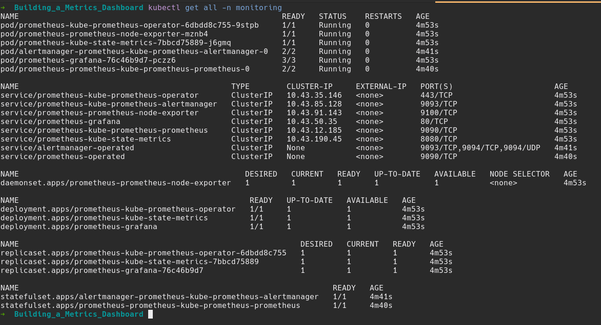
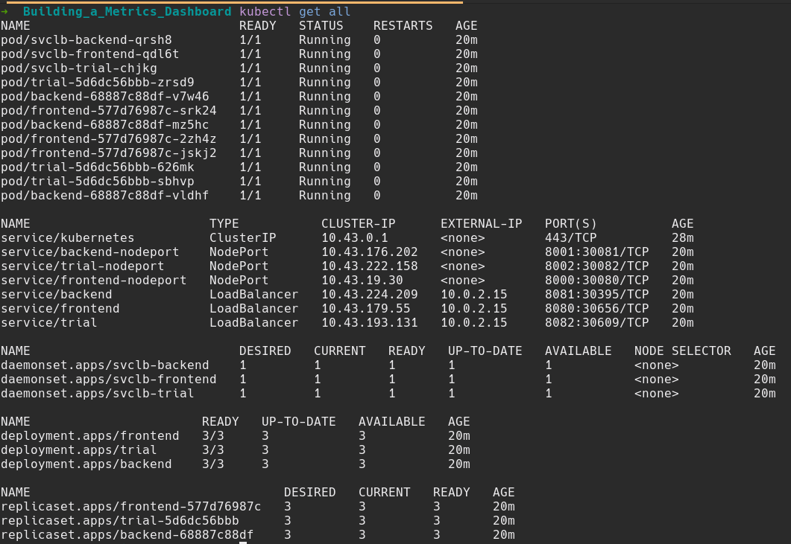

**Note:** For the screenshots, you can store all of your answer images in the `answer-img` directory.

## Verify the monitoring installation

*TODO:* run `kubectl` command to show the running pods and services for all components. Take a screenshot of the output and include it here to verify the installation
#### Monitoring Namespace

#### Observability Namespace

#### Flask Application

## Setup the Jaeger and Prometheus source
*TODO:* Expose Grafana to the internet and then setup Prometheus as a data source. Provide a screenshot of the home page after logging into Grafana.
#### Grafana Homepage

#### Grafana Sources

## Create a Basic Dashboard
*TODO:* Create a dashboard in Grafana that shows Prometheus as a source. Take a screenshot and include it here.

## Describe SLO/SLI
*TODO:* Describe, in your own words, what the SLIs are, based on an SLO of *monthly uptime* and *request response time*.

SLI or Service Level Indicators, are specific metric used to measure the performance of a service. They are used to indicate whether we have achieved our SLOs.
Based on SLOs of monthly uptime and request response time, few example of SLIs are, last month application uptime was 99.5% or last month 95% of requests to the backend service responded in less than 200ms.

## Creating SLI metrics.
*TODO:* It is important to know why we want to measure certain metrics for our customer. Describe in detail 5 metrics to measure these SLIs. 

The following metrics are used, these are selected while considering the Four Golden Signals (latency, trafic, error, saturation):
- Uptime, the measurement of time when our services are available.
- CPU Utilization, the percentage of total processing power currently under use.
- Response Time, the amount of time taken to process a request and return response to it.
- Number of 40x errors
- Number of 50x errors

## Create a Dashboard to measure our SLIs
*TODO:* Create a dashboard to measure the uptime of the frontend and backend services We will also want to measure to measure 40x and 50x errors. Create a dashboard that show these values over a 24 hour period and take a screenshot.

## Tracing our Flask App
*TODO:*  We will create a Jaeger span to measure the processes on the backend. Once you fill in the span, provide a screenshot of it here. Also provide a (screenshot) sample Python file containing a trace and span code used to perform Jaeger traces on the backend service.
#### Frontend app.py

#### Backend app.py

#### Jaeger UI

#### Grafana Jaeger Trace

## Jaeger in Dashboards
*TODO:* Now that the trace is running, let's add the metric to our current Grafana dashboard. Once this is completed, provide a screenshot of it here.

## Report Error
*TODO:* Using the template below, write a trouble ticket for the developers, to explain the errors that you are seeing (400, 500, latency) and to let them know the file that is causing the issue also include a screenshot of the tracer span to demonstrate how we can user a tracer to locate errors easily.

TROUBLE TICKET

Name: Request endpoint star fail throw 405 Method Not Allowed

Date: Jan 03 2022, 14:50 PM

Subject: Backend can't acces MongoDB

Affected Area: Backend Service

Severity: High

Description:  As we port-forwarding the application accessing /star endpoint, it throw 405 error which is caused by the mongodb://example-mongodb-svc.default.svc.cluster.local:27017/example-mongodb URL is not exist in the cluster. We need to make the MongoDB URL available for the cluster.

## Creating SLIs and SLOs
*TODO:* We want to create an SLO guaranteeing that our application has a 99.95% uptime per month. Name four SLIs that you would use to measure the success of this SLO.

**SLOs:**

1. 99.95% of uptime per month
2. .03% of 40x/50x responses per month.
3. Application responses should be served within 1500 ms per month.
4. Monthly average CPU usage should be 60% or less.
5. Monthly average memory usage should not exceed 600Mib.

**SLIs:**

1. The average 20x or 30x responses of the web application for the month of January 2022 is 97.99%.
2. 1.5% of the total incoming requests had 50x responses for the month of January 2022.
3. It took an average of 1070 ms for incoming requests to be served for the month of January 2022.
4. The average CPU usage of the application is 42.65% for the month of January 2022.
5. The average memory usage of the application is 300Mib for the month of January 2022.

## Building KPIs for our plan
*TODO*: Now that we have our SLIs and SLOs, create a list of 2-3 KPIs to accurately measure these metrics as well as a description of why those KPIs were chosen. We will make a dashboard for this, but first write them down here.

1. The average 20x or 30x responses of the web application for the month of January 2022 is 97.99%.
   - Monthly uptime - this KPI indicates the total usability of the application.
   - 20x code responses per month - this KPI indicates availability of the pages of the application.
   - Monthly traffic - this KPI will indicate the number of requests served by the application.
2. 1.5% of the total incoming requests had 50x responses for the month of January 2022.
   - Monthly downtime - this KPI indicates the number of times the application was down
   - Errors per month - this KPI will indicate the monthly errors encountered in the application.
   - Monthly traffic - this KPI will indicate the number of requests served by the application.
3. It took an average of 1070 ms for incoming requests to be served for the month of January 2022.
   - Average monthly latency - this KPI will indicate the time it took for the application to respond to requests.
   - Monthly uptime - this KPI indicates the total usability of the application.
   - Monthly traffic - this KPI will indicate the number of requests served by the application.
4. The average CPU usage of the application is 42.65% for the month of January 2022.
   - Average monthly CPU usage of pod used by the application - this KPI will indicate how much CPU is used by the source pod of the application.
   - Average monthly CPU usage of all the pods - this KPI will indicate how much CPU is used by all the pods required to run the application.
   - Monthly quota limit - this KPI will indicate whether the application is exceeding its usage of the CPU quota.
5. The average memory usage of the application is 300Mib for the month of January 2022.
   - Average monthly memory usage of pod used by the application - this KPI will indicate how much memory is used by the source pod of the application.
   - Average monthly memory usage of all the pods - this KPI will indicate how much memory is used by all the pods required to run the application.
   - Monthly quota limit - this KPI will indicate whether the application is exceeding its usage of the memory quota.

## Final Dashboard
*TODO*: Create a Dashboard containing graphs that capture all the metrics of your KPIs and adequately representing your SLIs and SLOs. Include a screenshot of the dashboard here, and write a text description of what graphs are represented in the dashboard.  

Discription of panel in dashboard:
- Uptime: Uptime of the service, by measuring the number of 20x and 30x responses.
- Response Time: Average respond time of the request.
- 50x Error: 50x respond from our service
- 40x Error: 40x respond from our service
- CPU Usage: CPU utilization by the service
- Memory Usage: Memory utilization by the service
